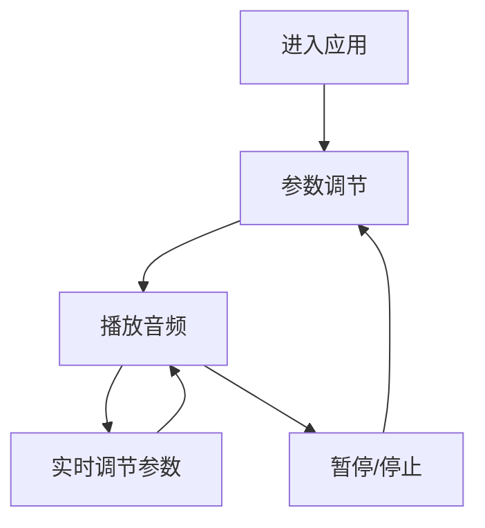

# 白噪音应用产品需求文档

## 1. 产品概述

白噪音应用是一个基于Web的音频生成工具，通过三个核心参数（能量、明暗、速度）动态生成和调制白噪音声景，为用户提供放松、专注或睡眠辅助的音频体验。

该应用使用Tone.js音频引擎，实现专业级的音频信号处理链，将抽象的用户控制参数映射到具体的音频属性，创造丰富多样的声音纹理。

## 2. 核心功能

### 2.1 功能模块

我们的白噪音应用包含以下主要页面：
1. **主控制页面**：参数控制面板、播放控制、音频可视化显示

### 2.2 页面详情

| 页面名称 | 模块名称 | 功能描述 |
|---------|---------|----------|
| 主控制页面 | 参数控制面板 | 提供能量、明暗、速度三个滑块控制器，实时调节音频参数 |
| 主控制页面 | 播放控制 | 包含播放/暂停按钮，音量控制滑块 |
| 主控制页面 | 音频可视化 | 显示当前音频波形或频谱，提供视觉反馈 |
| 主控制页面 | 参数显示 | 实时显示当前三个核心参数的数值 |

## 3. 核心流程

用户访问应用后，可以通过三个主要参数滑块调节声音特性：
- **能量参数**：控制音量大小和混响强度，营造空间感
- **明暗参数**：调节音色从温暖模糊到清晰明亮的过渡
- **速度参数**：控制声景的内在脉动频率

用户可以随时播放/暂停音频，并通过音量滑块控制总体音量。音频可视化组件提供实时的视觉反馈。

## 4. 用户界面设计

### 4.1 设计风格

- **主色调**：深蓝色 (#1a1a2e) 和浅蓝色 (#16213e)
- **辅助色**：白色 (#ffffff) 和浅灰色 (#f0f0f0)
- **按钮样式**：圆角矩形，带有轻微阴影效果
- **字体**：系统默认无衬线字体，主要文字16px，标签文字14px
- **布局风格**：居中卡片式布局，简洁现代
- **图标风格**：简约线条图标，播放/暂停使用标准媒体图标

### 4.2 页面设计概览

| 页面名称 | 模块名称 | UI元素 |
|---------|---------|--------|
| 主控制页面 | 参数控制面板 | 三个垂直滑块，标签为"能量"、"明暗"、"速度"，滑块颜色渐变，数值显示在滑块旁 |
| 主控制页面 | 播放控制 | 居中的圆形播放/暂停按钮，下方为水平音量滑块 |
| 主控制页面 | 音频可视化 | 简单的波形显示或频谱条，使用浅蓝色渐变 |
| 主控制页面 | 参数显示 | 三个参数的当前数值，以百分比形式显示 |

### 4.3 响应式设计

应用采用桌面优先设计，同时适配移动设备。在移动端，滑块控制器将调整为更适合触摸操作的尺寸，布局将从水平排列调整为垂直堆叠。