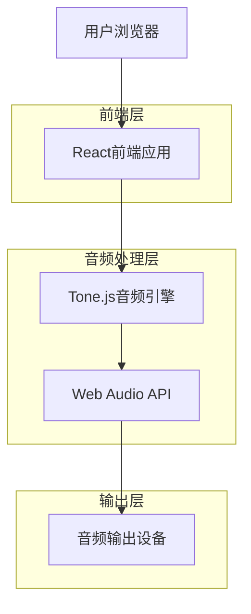
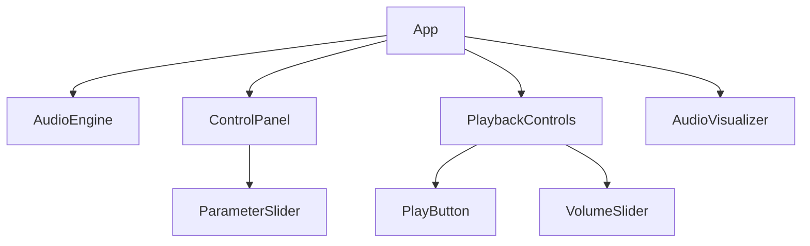
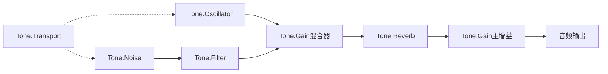

# 白噪音应用技术架构文档

## 1. 架构设计



## 2. 技术描述

* 前端：React\@18 + TypeScript\@5 + Vite\@5

* 音频引擎：Tone.js\@14

* 样式：CSS Modules + 原生CSS

* 包管理：pnpm

## 3. 路由定义

| 路由 | 用途                   |
| -- | -------------------- |
| /  | 主控制页面，包含所有音频控制和可视化功能 |

## 4. 核心组件架构

### 4.1 组件层次结构



### 4.2 核心接口定义

```typescript
// 音频参数接口
interface AudioParameters {
  energy: number;    // 0-100
  brightness: number; // 0-100
  speed: number;     // 0-100
}

// 音频引擎状态接口
interface AudioEngineState {
  isPlaying: boolean;
  volume: number;    // 0-1
  parameters: AudioParameters;
}

// 滑块组件属性接口
interface SliderProps {
  label: string;
  value: number;
  min: number;
  max: number;
  onChange: (value: number) => void;
}
```

## 5. 音频信号链实现

### 5.1 Tone.js信号链架构



### 5.2 参数映射关系

| 用户参数               | 音频属性             | 映射函数                   |
| ------------------ | ---------------- | ---------------------- |
| Energy (0-100)     | master.gain      | energy / 100           |
| Energy (0-100)     | reverb.wet       | energy / 200 + 0.1     |
| Brightness (0-100) | filter.frequency | 200 + brightness \* 50 |
| Brightness (0-100) | reverb.preDelay  | brightness / 1000      |
| Speed (0-100)      | Transport.bpm    | 60 + speed \* 1.2      |

## 6. 数据流管理

### 6.1 状态管理

应用使用React的useState和useContext进行状态管理，不引入额外的状态管理库。

```typescript
// 音频上下文
const AudioContext = createContext<{
  state: AudioEngineState;
  updateParameters: (params: Partial<AudioParameters>) => void;
  togglePlayback: () => void;
  setVolume: (volume: number) => void;
}>({} as any);
```

### 6.2 音频引擎生命周期

1. **初始化阶段**：创建Tone.js音频节点和连接
2. **参数更新阶段**：响应用户输入，实时更新音频参数
3. **播放控制阶段**：处理播放/暂停状态切换
4. **清理阶段**：组件卸载时释放音频资源

## 7. 性能优化策略

* 使用React.memo优化组件重渲染

* 音频参数更新使用防抖处理，避免过于频繁的音频引擎调用

* 音频可视化使用requestAnimationFrame优化渲染性能

* Tone.js音频节点复用，避免频繁创建和销毁

## 8. 项目结构

```
src/
├── components/
│   ├── AudioEngine.tsx
│   ├── ControlPanel.tsx
│   ├── PlaybackControls.tsx
│   ├── AudioVisualizer.tsx
│   └── ParameterSlider.tsx
├── hooks/
│   ├── useAudioEngine.ts
│   └── useAudioVisualizer.ts
├── types/
│   └── audio.ts
├── utils/
│   └── audioMapping.ts
├── styles/
│   └── components/
├── App.tsx
└── main.tsx
```

